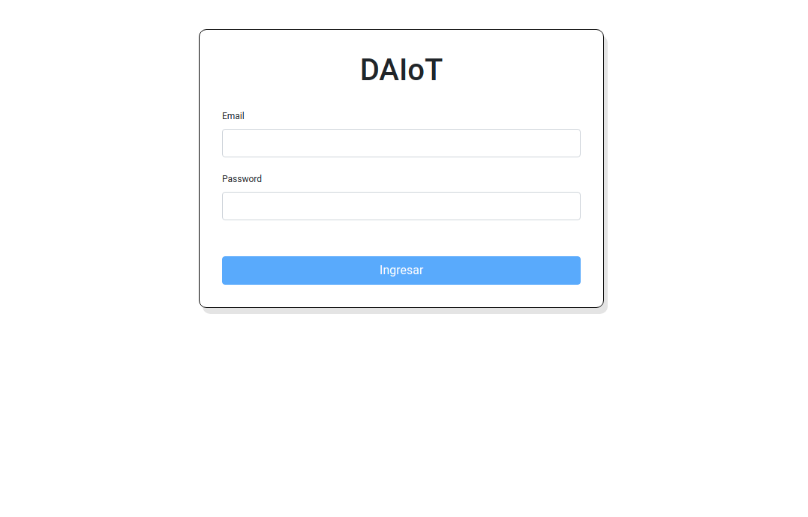
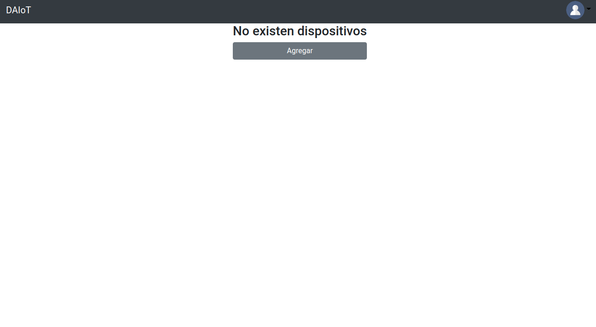
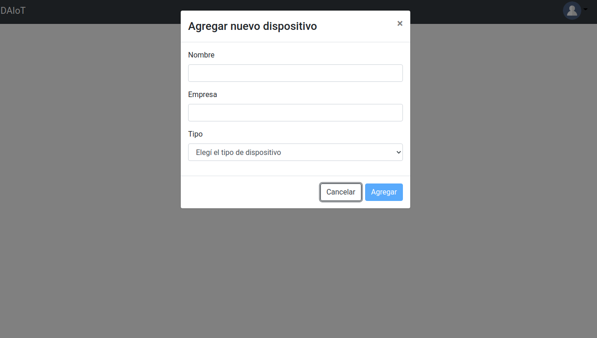
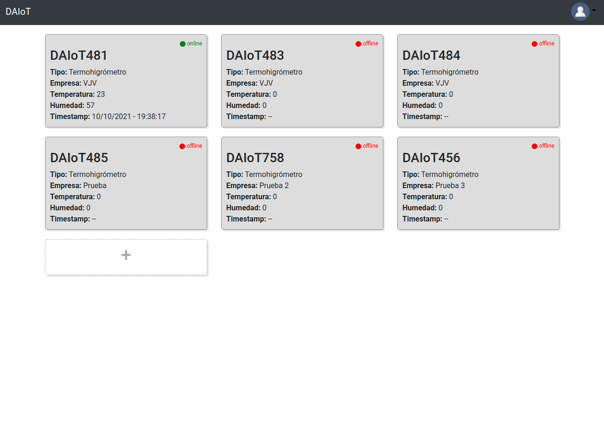
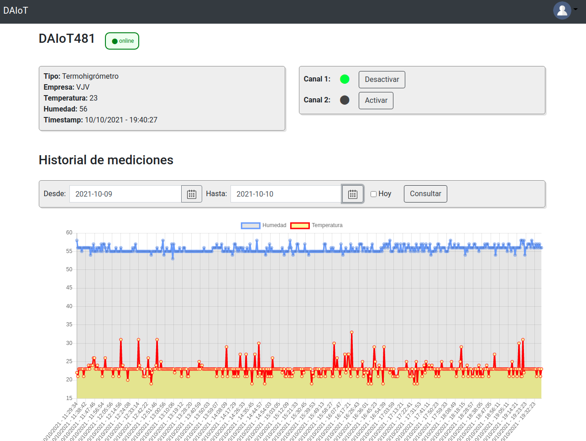
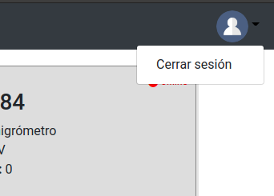

MIoT - DAIoT: Trabajo Final - Frontend
=======================

## Primeros pasos

### Instalar las dependencias

Para correr esté código es necesario contar con `Node.js` y `Angular`

`Node` se puede descargar desde el siguiente [link](https://nodejs.org/es/).

Una vez instalado Node, también instala el manejador de paquetes `npm`. Mediante esta utilidad, se debe instalar `Angular` ejecutando el siguiente comando:

```
npm install -g @angular/cli 
```


### Descargar el código

Para descargar el código se debe ejecutar el siguiente comando:
```
git clone https://github.com/mmondani/MIoT_DAIoT_Frontend.git
```

### Ejecutar el código

Para correr el proyecto, ubicándose dentro de la carpeta raiz del mismo, ejecutar los siguientes comandos:

```
npm install
ng serve
```

Mediante estos comandos se van a descargar todas las dependencias del proyecto y se va a abrir una instancia de un browser para poder visualizar el proyecto


## Detalles de implementación

El frontend fue implementado usando Angular. Para interactuar con los sensores y obtener los datos, la aplicación se va a comunicar con el backend a través de requests a los puertos `3000` y `3001`. Si se quieren usar otros puertos, se deben hacer los cambios correspondientes en los archivos `src/app/services/login.service.ts` y `src/app/services/devices.service.ts`.

Además, para mostrar en tiempo real el estado de los canales de cada sensor, su estado de conexión con el broker y las últimas mediciones, la aplicación se conecta con el broker MQTT, a través de WebSockets, a la dirección `localhost` y puerto `9001`. La dirección y el puerto del broker están configuradas en el archivo `src/environments/environment.ts`.

Al iniciar la aplicación, lo primero que se presenta es una pantalla de login. Al iniciar el backend, se crea un primer usuario llamado `admin`. Nuevos usuarios pueden ser creados usando el endpoint `/register` de la API.



Ya sea usando el usuario `admin` o uno distinto, luego de hacer el login, se presentará la siguiente pantalla:



Se debe presionar el botón `Agregar` para dar de alta un nuevo sensor:



Por el momento solo está implementado el tipo de sensor Termohigrómetro.

Una vez dados de alta los sensores, de cada uno de ellos se podrá ver:

- El nombre
- La empresa
- La última medición de temperatura y humedad.
- El timestamp de esta última medición
. El estado de conexión (online u offline)



Al hacer click en cada uno de los sensores, se podrá ver un detalle del mismo. Se visualizará el estado de cada uno de los canales y se podrán activar o desactivar estos.

Además se podrá ver un gráfico con el historial de mediciones, tanto para el día de hoy como para un rango de fechas.



Finalmente, en el extremo derecho de la barra superior, hay un ícono de Perfil, en el cual, al hacer click, permite cerrar la sesión.

